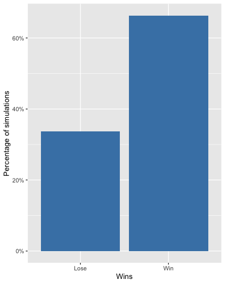

# Monty Hall Simulation

## Overview
This project is to simulate the Monty Hall problem. The problem is based around
a game show where there are three doors with a car behind one. The contestant
chooses a door, then the host opens one of the other doors that doesn't hide
the car. The contestant can then decide whether to change their choice to the
other door. Statistically, it is better to change the door option as the
contestant will have a 66% chance of choosing the door with the car, opposed to
the 33% chance with their previous door selection. I set out to create a
simulation of this problem using the theory of large numbers to show that the
percentages work out as a 66-33 chance opposed to a 50-50. 

## Methods
This repository contains two programs: monty_hall_game.py and run_simulation.R.

The first script, monty_hall_game.py, simulates one game. It always chooses
to change the door after the "host" opens a door. It then checks whether the
car is behind it and if the contestant wins.

The second script, run_simulation.R, runs 10,000 simulated runs of this game.
It creates a bar plot to show the proportion of wins to losses.

## Results
This simulation shows that the percentage of wins, that is choosing the door
with the car behind it, is about 66%, while the percentage of losses is 33%
(Figure 1). This is what is expected.

   
Figure 1 - a bar plot showing the percentage of wins and losses after running
the Monty Hall simulation.

## How to Execute Files
*monty_hall_game.py*   
`$ python3 monty_hall_game.py`   
This is for one simulation of the game.

*run_simulation*   
`$ R run_simulation.R`

